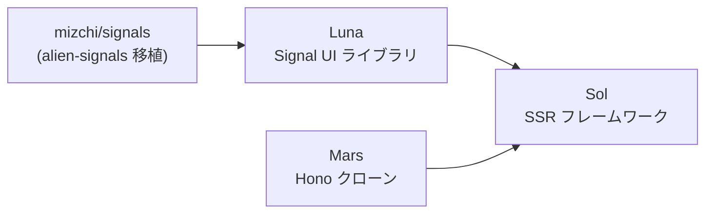
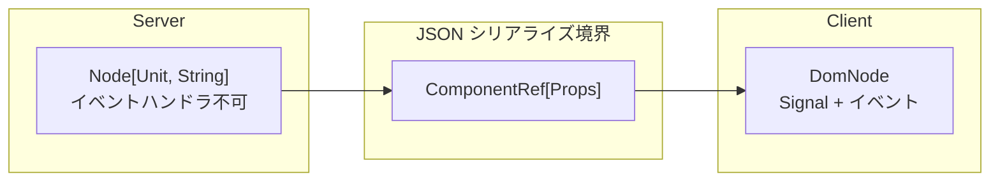
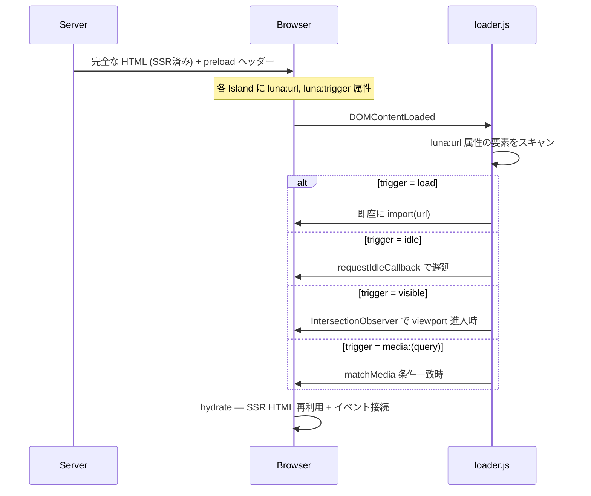

# 今、すべてを作り直すなら - Luna/Sol の SSR と Island Architecture

## 自己紹介

<!-- TODO: 自己紹介を書く -->

## 最近やってること (すべて AI と共同開発)

- `mizchi/crater` — 自作ブラウザ。Web Platform Tests の css-* 系をほぼ通過
- `mizchi/vibe-lang` — 自作言語。WASM 上でセルフホストを達成
- `mizchi/kagura` — 自作 2D/3D ゲームエンジン。WebGPU のみサポート
- `bit-vcs/bit` — Git 互換実装。JS(60k) / WASM(340k) で実行可能
- `mizchi/actrun` — GitHub Actions Workflow 互換のタスクランナー

**せっかく AI 使うんなら、でかいことをしようぜ**

---

## モチベーション

- 理想の最適化手法: Qwik/Astro の Island Architecture
- 理想のフレームワーク: Solid
- React はエコシステムは充実しているが、ランタイムコストが多すぎる
- SSR を完璧に制御するなら、垂直統合するしかない
- → 設計はゼロから、良い実装は移植して活用。自分の理想を検証する

---

## Why MoonBit

MoonBit: Rust 風の型システムを持つ関数型言語。WASM ファースト設計。

- **1つのコードから JS / WASM / Native にビルドできる**
  - TypeScript: JS のみ。Rust: WASM/Native はできるがフロントエンドとの統合が辛い
- JS バックエンドでは minify フレンドリーなフラットな名前空間でコード生成 → バンドルサイズが肥大化しない
- MoonBit の構文補足: `@pkg` はモジュール参照、`pub fn` は公開関数、`[T]` はジェネリクス

---

## 作ったもの: 全体像



| プロジェクト | 役割 | 一言 |
|------------|------|------|
| **mizchi/signals** | リアクティブプリミティブ | alien-signals (Vue 3.6 採用) の MoonBit 移植 |
| **Luna** | UI ライブラリ | Solid 風 API、9.4KB gzip、関数 DSL |
| **Mars** | HTTP サーバー | Hono クローン。MoonBit で統一するため自作 |
| **Sol** | フルスタック SSR | Luna + Mars + Island Architecture |

---

## Luna — Signal ベースの UI

https://github.com/mizchi/luna.mbt

- 変更があった Signal に追従して View を差分アップデート (トップダウン再描画ではない)
- API は Solid ベース。JSX 構文は議論中 → 一旦は関数 DSL

```moonbit
pub fn counter(props : CounterProps) -> DomNode {
  let count = @signal.signal(props.initial_count)
  div(class="counter", [
    span(class="count-display", [text_of(count)]),
    button(on=events().click(_ => count.update(n => n - 1)), [text("-")]),
    button(on=events().click(_ => count.update(n => n + 1)), [text("+")]),
  ])
}
```

### パフォーマンス: Luna vs Preact vs React (Chromium, vitest bench)

| 項目 | Luna | Preact | React |
|------|------|--------|-------|
| Static Grid (2,500 cells) | 2,188 ops/s | 2,276 ops/s | 227 ops/s |
| Large Grid (5,000 cells) | 1,035 ops/s | 1,153 ops/s | 111 ops/s |
| Bundle size | **9.4KB** | 11KB | 58KB |

Luna は Preact と同等、**React の約 10x 高速**

---

## Sol — フルスタック SSR フレームワーク

https://github.com/mizchi/sol.mbt

対応ランタイム: Node.js / Cloudflare Workers / Native

```moonbit
// ルート定義: レイアウト、ページ、ミドルウェアを宣言的に構成
pub fn routes() -> Array[@sol.SolRoutes] {
  [
    @sol.with_mw([@mw.logger()], [              // ミドルウェア適用
      @sol.wrap("", root_layout, [              // レイアウト
        @sol.route("/", home, title="Home"),     // ページ
        @sol.route("/docs/[...slug]", docs_page, title="Docs"),
      ]),
      @sol.api_get("/api/health", api_health),  // API エンドポイント
    ]),
  ]
}
```

Mars (Hono クローン) の上に構築。MoonBit で統一するために Hono を直接使わず自作。

---

## Next.js の問題と Sol の解答

### 背景

- 2025末: Next.js の RSC Flight Protocol にリモートコード実行 (RCE) 脆弱性
  - https://www.ipa.go.jp/security/security-alert/2025/alert20251209.html
- クライアントコードを部分的にサーバーでレンダリング → **境界が曖昧になり、ミスが起きる**

### Sol の設計: 型でサーバー/クライアントを分離する

`"use client"` / `"use server"` ディレクティブではなく、**型レベルで境界を強制**する。



**サーバー側** — 戻り値 `ServerNode` = `Node[Unit, String]` (イベントなし)

```moonbit
async fn home(_props : @sol.PageProps) -> @server_dom.ServerNode {
  @server_dom.ServerNode::async_(fn() {
    let props : @types.CounterProps = { initial_count: 42 }
    @luna.fragment([
      h1([text("Welcome")]),
      // ↓ 境界: Props を JSON で渡してクライアント Island を埋め込む
      @server_dom.client(@types.counter(props), [
        div(class="counter", [text("42")]),  // SSR フォールバック
      ]),
    ])
  })
}
// on=events().click(...) を書くとコンパイルエラー (Unit ≠ DomEvent)
```

**クライアント側** — 戻り値 `DomNode` (Signal + イベントハンドラ)

```moonbit
pub fn counter(props : CounterProps) -> DomNode {
  let count = @signal.signal(props.initial_count)
  div(class="counter", [
    text_of(count),
    button(on=events().click(_ => count.update(n => n + 1)), [text("+")]),
  ])
}
```

**Next.js との違い:** ディレクティブの書き忘れが発生しない。型が違うのでコンパイラが強制する。

---

## Island Architecture: SSR → Hydration の仕組み



- サーバーは SSR + preload ヘッダー注入（だけ）
- クライアント側で **trigger 条件に応じて選択的に hydrate**
- ファーストビュー不要な Island は JS を読み込みすらしない

---

## WebComponents: SSR 対応と限界

Sol では Declarative Shadow DOM (`<template shadowrootmode="open">`) で WebComponents SSR に対応。

しかし、**すべてのコンポーネントを WC にするのはアンチパターン**:

### ベンチマーク: Plain DOM vs WebComponents (Chromium)

| 項目 | Plain DOM | WC | 比率 |
|------|-----------|-----|------|
| イベントバブリング | 451K ops/s | 39K ops/s (3段ネスト) | **11.7x 遅い** |
| コンポーネント初期化 (100個) | 3,425 ops/s | 972 ops/s (DSD) | **3.5x 遅い** |
| Context 伝搬 (10階層) | — | — | **10-12x 遅い** |

→ 末端の装飾的な要素拡張には有効だが、データ伝搬レイヤーに WC を適用すべきではない

---

## MoonBit を使ってみて

### クロスコンパイルの威力

- SSR 最難関: サーバー/クライアントで同じ出力をする担保 → 今まで JS でしか無理だった
- MoonBit: **同一コードから JS/Native にビルドして SSR の一致を型で保証**
- TypeScript と共存可能。段階的に置き換えられる

### Native の現状

同一ハンドラコード、トランスポートのみ異なる比較 (k6 ベンチマーク):

| Metric | Native | JS (Node.js) | Ratio |
|--------|--------|-------------|-------|
| Requests/sec | 12,376 | 16,820 | 73.6% |
| Avg latency | 768µs | 556µs | 1.38x slower |

Native コンパイラの最適化は発展途上。ボトルネックは参照カウント (~15%) と文字列操作 (~13%)。
V8 + libuv の最適化が優秀で、現時点では JS ターゲットの方が速い。

### AI との開発

- コンパイラの警告が優秀 + 公式 AI Skills で補完できる
  - https://github.com/moonbitlang/moonbit-agent-guide
- ライブラリ不足は AI で踏み倒せる: 「テストコード移植して出力一致まで実装して」

---
