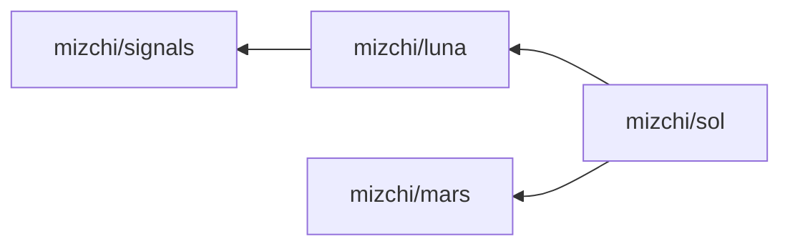
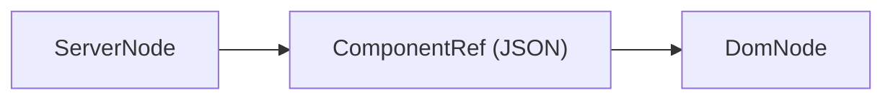
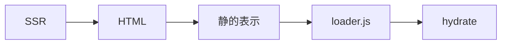

# 今、すべてを作り直すなら

## Luna/Sol の SSR と Island Architecture

mizchi | v-tokyo 24 | 2026

---

## mizchi

- フリーランス | Node.jsとフロントエンドが専門
- 最近は専ら AI で開発パイプラインを自動化することが専門
- [2020年版: なぜ仮想 DOM / 宣言的 UI という概念が、あのときの俺達の魂を震えさせたのか](https://zenn.dev/mizchi/books/0c55c230f5cc754c38b9)
- [CLINE に全部賭けろ](https://zenn.dev/mizchi/articles/all-in-on-cline)

----

### 最近やってること

- MoonBit でバイブコーディング楽しすぎる
- `mizchi/crater` — 自作ブラウザ (WPT css-* 系ほぼ通過)
- `mizchi/vibe-lang` — 自作 WebAssembly 言語 (セルフホスト達成)
- `mizchi/kagura` — 2D/3D ゲームエンジン (WebGPU Renderer)
- `mizchi/actrun` — GitHub Actions 互換タスクランナー
- `bit-vcs/bit` — Git 互換 (JS 60k / WASM 340k)

**せっかく AI 使うんなら、でかいことをしようぜ**

---

## Demo

- https://mizchi.github.io/kagura/hacknslash_3d/
- https://mizchi.github.io/kagura/crater_renderer/
- https://moonlight.mizchi.workers.dev/

---

## Sol | WebComponents & SSR-first Web Framework

MoonBit 製フルスタック SSR フレームワーク (WebComponents + SSR **たぶん世界初**)

https://github.com/mizchi/sol.mbt

```bash
moon install mizchi/sol/cmd/sol
sol new myapp
cd myapp && pnpm install
sol dev  # http://localhost:7777
```

Demo https://sol-example.mizchi.workers.dev/

---

## Sol の Goal

- いくら待っても自分が欲しいものが生まれない => 作る
- **軽量ランタイム + island の選択的ハイドレーション**
- **WebComponents First** — Declarative Shadow DOM への SSR 対応
- **型の契約によるセキュリティ境界** — サーバー/クライアントの混在をコンパイルエラーに(後述)
- **Island Architecture** — 不要な JS は読み込まない
- SSR を制御するにはサーバーとの垂直統合しかない

---

## Why MoonBit

**Rust 風の型システムを持つ関数型言語。JS / WASM / Native にビルド可能。**

- TypeScript より関数型の機能が多く、表現力が豊か
  - パイプライン `|>`, パターンマッチ `match`, 代数的データ型, trait
- Minify フレンドリーな JS を生成 → バンドルサイズが肥大化しない
- 1つのコードから **3つの選択肢**:
  - **JS** — 今まで通り npm で配布。エコシステムと共存
  - **WASM** — ポータブルなサンドボックス実行
  - **Native** — 起動速度・スループットを追求
- (そもそも何作っても最初なので)好き勝手作っても怒られにくい

---

## MoonBit の コード例

```moonbit
pub async fn handle(route : Route) -> Response raise ServerError {
  match route {
    Get(path) => path |> load_page |> render_html
    Post(_, body) => body |> parse_json |> save_data
    NotFound => { status: 404, body: "Not Found" }
  }
}
```

- `|>` F#スタイル関数パイプライン
- パターンマッチ
- 明示的な例外

---

## MoonBit → JS コンパイル例 (`moon build --target js`)

```js
function _M0TP25slide7example8Response(param0, param1) {
  this.status = param0; this.body = param1;
}
const _M0FP25slide7example19handle_2erecord_2f5
  = new _M0TP25slide7example8Response(404, "Not Found");
function _M0FP25slide7example6handle(route) {
  switch (route.$tag) {
    case 0: return _M0FP25slide7example12render__html(
      `<h1>${route._0}</h1>`);
    case 1: return _M0FP25slide7example10save__data(route._1);
    default: return _M0FP25slide7example19handle_2erecord_2f5;
  }
}
```

minify に優しい => MoonBit で書いて npm で配布可能

---

## Sol の内部構成

| 名前 | 役割 | 概要 |
|------|------|------|
| [mizchi/signals](https://github.com/mizchi/signals.mbt) | リアクティブ基盤 | alien-signals (Vue 3.6で採用) の MoonBit 移植 |
| [mizchi/luna](https://github.com/mizchi/luna.mbt) | UI ライブラリ | Solid 風 API、9.4KB gzip |
| [mizchi/mars](https://github.com/mizchi/mars.mbt) | HTTP サーバー | Hono クローン |
| [mizchi/sol](https://github.com/mizchi/sol.mbt) | フルスタック SSR | Luna + Mars + Island Architecture |



---

## Luna — Signal ベースの UIライブラリ

```moonbit
pub fn counter(props : CounterProps) -> DomNode {
  let count = @signal.signal(props.initial_count)
  div(class="counter", [
    text(count),
    button(on=events().click(_ => count.update(n => n + 1)), [text("+")]),
  ])
}
```

- TreeShake 次第で preact より軽量 (~3kb)
- Demo [https://luna-examples.mizchi.workers.dev/playground/game/](https://luna-examples.mizchi.workers.dev/playground/game/)

---

## Mars | Hono Clone Server

Hono API を模倣したサーバーフレームワーク

```mbt
async fn main {
  @mars.Server::new()
  ..get("/", async fn(ctx) { ctx.text("Hello, Mars!") })
  ..get("/users/:id", async fn(ctx) {
    let id = ctx.param("id").unwrap()
    ctx.json({ "id": id })
  })
  ..serve(host="127.0.0.1", port=3000)
}
```

---

## Sol — Luna + Mars 上の SSR

- **サーバー用の型とクライアント用の型を分離** — 混在するとコンパイルエラー
- サーバーコンポーネントは **最初から async** — DB アクセスも自然に書ける
- クライアントは **Signal ベース** — 必要な部分だけ hydrate
Luna + Mars で構成。対応: Node.js / Cloudflare Workers / Native


---

## Sol: ルーティング

```moonbit
pub fn routes() -> Array[@sol.SolRoutes] {
  [
    @sol.with_mw([@mw.logger()], [
      @sol.wrap("", root_layout, [
        @sol.route("/", home, title="Home"),
        @sol.route("/docs/[...slug]", docs_page),
      ]),
      @sol.api_get("/api/health", api_health),
    ]),
  ]
}
```

---

## Sol: async サーバーコンポーネント

```moonbit
async fn user_page(props : @sol.PageProps) -> @server_dom.ServerNode {
  @server_dom.ServerNode::async_(fn() {
    let id = props.params["id"].unwrap()
    let user = db_find_user(id)  // async DB アクセス
    @luna.fragment([
      h1([text(user.name)]),
      @server_dom.client(@types.profile(user.to_props()), [
        div([text("Loading...")]),  // SSR フォールバック
      ]),
    ])
  })
}
```

---

## 昨今の Next.js の問題

- 2025末: Next.js RSC にリモートコード実行 (RCE) 脆弱性
- クライアントコードを部分的にサーバーでレンダリング → **境界が曖昧**
- `"use client"` / `"use server"` — ディレクティブ依存は人間のミスを防げない

---

## Sol の解答: 型でサーバー/クライアントを分離



- サーバーとクライアントで **型が違う** → 混在するとコンパイルエラー
- 唯一の接点は `ComponentRef[T]` — Props を JSON で橋渡し

---

## 型境界: サーバー側

戻り値 `ServerNode` — **イベントハンドラが型的に書けない**

```moonbit
async fn home(_props : @sol.PageProps) -> @server_dom.ServerNode {
  @server_dom.ServerNode::async_(fn() {
    let props : @types.CounterProps = { initial_count: 42 }
    @luna.fragment([
      h1([text("Welcome")]),
      // ↓ クライアント Island を埋め込む
      @server_dom.client(@types.counter(props), [
        div(class="counter", [text("42")]),  // SSR フォールバック
      ]),
    ])
  })
}
```

---

## 型境界: Client Props は JSON シリアライズのみ

```moonbit
// サーバーとクライアントで共有する Props 型
pub(all) struct CounterProps {
  initial_count : Int
} derive(ToJson, FromJson)  // JSON 変換を自動導出する trait

// クライアント側: Props を受け取って DomNode を返す
pub fn counter(props : CounterProps) -> DomNode {
  let count = @signal.signal(props.initial_count)
  div(class="counter", [
    text_of(count),
    button(on=events().click(_ => count.update(n => n + 1)), [text("+")]),
  ])
}
```

Props は `ToJson + FromJson` を実装した型のみ → **関数やコールバックは渡せない**

---

## SSR → Hydration の全体フロー



1. サーバーが完全な HTML を返す (JS なしで表示可能)
2. `loader.js` が `luna:trigger` 条件に応じて段階的に hydrate
3. 不要な Island の JS は読み込まない

---

## Island の HTML 出力

SSR が生成する HTML:

```html
<div luna:url="/static/counter.js"
     luna:trigger="visible"
     luna:state='{"initial_count":42}'>
  <!-- SSR 済み HTML (JS なしで表示される) -->
  <div class="counter">
    <span class="count-display">42</span>
    <button class="inc">+</button>
  </div>
</div>
```

`luna:url` = JS モジュール, `luna:trigger` = hydration 条件, `luna:state` = Props JSON

---

## Sol の Hydration Trigger

| trigger | 発火 | ユースケース |
|---------|------|-------------|
| `load` | 即座 | ファーストビュー必須 |
| `idle` | requestIdleCallback | 非優先 |
| `visible` | IntersectionObserver | スクロールで見えたら |
| `media:(query)` | matchMedia | モバイルのみ等 |

**不要な Island は JS を読み込みすらしない**

---

## WebComponents: SSR 対応と限界

Declarative Shadow DOM で WC SSR に対応済み

| 項目 | Plain DOM | WC | 劣化 |
|------|-----------|-----|------|
| イベントバブリング | 451K ops/s | 39K ops/s | **11.7x** |
| 初期化 (100個) | 3,425 ops/s | 972 ops/s | **3.5x** |
| Context (10階層) | — | — | **10-12x** |

末端の装飾拡張には有効、データ伝搬には使わない

---

## MoonBit: Native の現状

**クロスコンパイル:** SSR の一致を言語レベルで保証

| Metric | Native | JS (Node.js) | Ratio |
|--------|--------|-------------|-------|
| Requests/sec | 12,376 | 16,820 | 73.6% |
| Avg latency | 768us | 556us | 1.38x slower |

- Native コンパイラは発展途上
- 現時点では V8 + libuv が優秀

---

## MoonBit + AI

- 型が厳密 → コンパイラがガイド → **AI が書きやすい**
- ライブラリ不足は AI で踏み倒す
  - 「テストコード移植して出力一致まで実装して」
  - 「`moon bench` でベンチマーク書いて改善して」

**AI が書きやすい言語 = 型が厳密でコンパイラがガイドしてくれる言語**

---

## Sol: 今後

1. Sol のドッグフーディング
  - API は予告なく変わります
2. MoonBit だけではない JS API 層を追加
3. 部分的に Vite Environment 化(WIP)

---

## 終わり

MoonBit 最高
