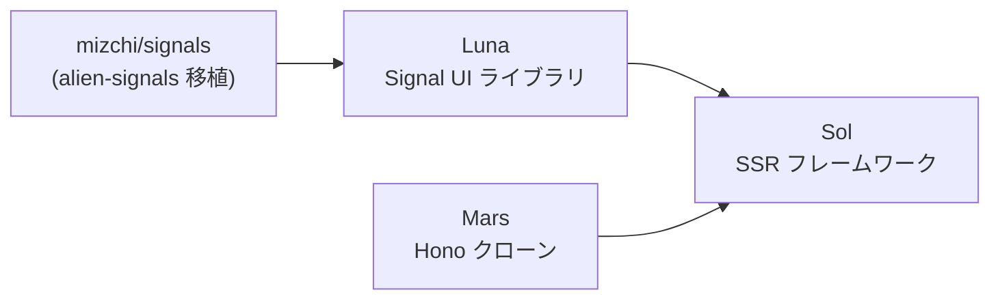
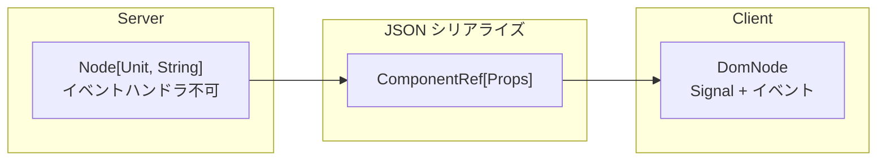

<!-- _class: lead -->

# 今、すべてを作り直すなら

## Luna/Sol の SSR と Island Architecture

<!-- TODO: 名前・所属 -->

---

## 自己紹介

<!-- TODO: 自己紹介を書く -->

### 最近やってること (すべて AI と共同開発)

- `mizchi/crater` — 自作ブラウザ (WPT css-* 系ほぼ通過)
- `mizchi/vibe-lang` — 自作言語 (WASM セルフホスト)
- `mizchi/kagura` — 2D/3D ゲームエンジン (WebGPU)
- `bit-vcs/bit` — Git 互換 (JS 60k / WASM 340k)
- `mizchi/actrun` — GitHub Actions 互換タスクランナー

**せっかく AI 使うんなら、でかいことをしようぜ**

---

## モチベーション

- 理想の最適化: **Qwik/Astro の Island Architecture**
- 理想のフレームワーク: **Solid**
- React — エコシステムは充実、しかしランタイムコストが多すぎる
- SSR を完璧に制御するなら **垂直統合するしかない**

→ 設計はゼロから、良い実装は移植して活用

---

## Why MoonBit

**Rust 風の型システムを持つ関数型言語。WASM ファースト設計。**

- 1つのコードから **JS / WASM / Native** にビルドできる
  - TypeScript: JS のみ。Rust: フロントエンド統合が辛い
- JS バックエンドは minify フレンドリーなフラット名前空間 → バンドルサイズが肥大化しない

※ 構文: `@pkg` = モジュール参照, `pub fn` = 公開関数

---

## 作ったもの



| 名前 | 役割 | 概要 |
|------|------|------|
| **signals** | リアクティブ基盤 | alien-signals (Vue 3.6 採用) の MoonBit 移植 |
| **Luna** | UI ライブラリ | Solid 風 API、9.4KB gzip |
| **Mars** | HTTP サーバー | Hono クローン (MoonBit 統一のため自作) |
| **Sol** | フルスタック SSR | Luna + Mars + Island Architecture |

---

## Luna — Signal ベースの UI

Signal の変更に追従して View を差分アップデート (トップダウン再描画ではない)

```moonbit
pub fn counter(props : CounterProps) -> DomNode {
  let count = @signal.signal(props.initial_count)
  div(class="counter", [
    span(class="count-display", [text_of(count)]),
    button(on=events().click(_ => count.update(n => n - 1)), [text("-")]),
    button(on=events().click(_ => count.update(n => n + 1)), [text("+")]),
  ])
}
```

| 項目 | Luna | Preact | React |
|------|------|--------|-------|
| Grid 2,500 cells | 2,188 ops/s | 2,276 ops/s | **227 ops/s** |
| Bundle size | **9.4KB** | 11KB | 58KB |

Preact と同等、**React の約 10x 高速**

---

## Sol — フルスタック SSR フレームワーク

Luna + Mars (Hono クローン) で構成。対応: Node.js / Cloudflare Workers / Native

```moonbit
pub fn routes() -> Array[@sol.SolRoutes] {
  [
    @sol.with_mw([@mw.logger()], [             // ミドルウェア
      @sol.wrap("", root_layout, [             // レイアウト
        @sol.route("/", home, title="Home"),    // ページ
        @sol.route("/docs/[...slug]", docs_page, title="Docs"),
      ]),
      @sol.api_get("/api/health", api_health), // API
    ]),
  ]
}
```

---

## Next.js の問題と Sol の解答

- 2025末: Next.js RSC にリモートコード実行 (RCE) 脆弱性
- クライアントコードを部分的にサーバーでレンダリング → **境界が曖昧になりミスが起きやすい構造**
- `"use client"` / `"use server"` — ディレクティブ依存は人間のミスを防げない

**Sol の解答: 型レベルで境界を強制する**



---

## 型によるセキュリティ境界: サーバー側

戻り値 `ServerNode` = `Node[Unit, String]` — **イベントハンドラが型的に書けない**

```moonbit
async fn home(_props : @sol.PageProps) -> @server_dom.ServerNode {
  @server_dom.ServerNode::async_(fn() {
    let props : @types.CounterProps = { initial_count: 42 }
    @luna.fragment([
      h1([text("Welcome")]),
      @server_dom.client(@types.counter(props), [
        div(class="counter", [text("42")]),
      ]),
    ])
  })
}
// on=events().click(...) → コンパイルエラー! (Unit ≠ DomEvent)
```

---

## 型によるセキュリティ境界: クライアント側

戻り値 `DomNode` — **Signal とイベントハンドラが使える**

```moonbit
pub fn counter(props : CounterProps) -> DomNode {
  let count = @signal.signal(props.initial_count)
  div(class="counter", [
    text_of(count),
    button(on=events().click(_ => count.update(n => n + 1)), [text("+")]),
  ])
}
```

**唯一の接点: `ComponentRef[T]`** — Props を JSON シリアライズして橋渡し

**Next.js との違い:** ディレクティブの書き忘れが発生しない。型が違うのでコンパイラが強制する。

---

## Island Architecture: SSR → Hydration

サーバーは SSR + preload ヘッダー注入 **だけ**。クライアントで選択的に hydrate。

| trigger | 発火タイミング | ユースケース |
|---------|--------------|-------------|
| `load` | 即座 (DOMContentLoaded) | ファーストビュー必須 |
| `idle` | requestIdleCallback | 非優先だが早めに |
| `visible` | IntersectionObserver | スクロールで見えたら |
| `media:(query)` | matchMedia | モバイルのみ等 |
| `none` | 手動 | プログラム制御 |

**不要な Island は JS を読み込みすらしない**

各 Island は HTML 属性 (`luna:url`, `luna:trigger`) で制御。loader.js が条件に応じて動的 import。

---

## WebComponents: SSR 対応と限界

Declarative Shadow DOM で WC SSR に対応済み。
しかし **全コンポーネントを WC にするのはアンチパターン:**

| 項目 | Plain DOM | WC | 劣化 |
|------|-----------|-----|------|
| イベントバブリング | 451K ops/s | 39K ops/s (3段) | **11.7x** |
| 初期化 (100個) | 3,425 ops/s | 972 ops/s | **3.5x** |
| Context (10階層) | — | — | **10-12x** |

**結論:** 末端の装飾拡張には有効、データ伝搬レイヤーには使わない
Sol では **Island 単位で WC/非WC を選択可能**

---

## MoonBit を使ってみて

**クロスコンパイルの威力:** SSR の一致を言語レベルで保証。TypeScript と共存可能。

### Native の現状 (同一ハンドラコード、k6 ベンチマーク)

| Metric | Native | JS (Node.js) | Ratio |
|--------|--------|-------------|-------|
| Requests/sec | 12,376 | 16,820 | 73.6% |
| Avg latency | 768µs | 556µs | 1.38x slower |

- Native コンパイラは発展途上 (参照カウント ~15%, 文字列操作 ~13%)
- 現時点では V8 + libuv が優秀。コンパイラ最適化で将来的に逆転の可能性

### AI との相性

- 型が厳密 → コンパイラがガイド → **AI が書きやすい**
- ライブラリ不足は AI で踏み倒す: 「テストコード移植して出力一致まで実装して」

---

## まとめ

1. **SSR を完璧に制御するなら垂直統合** — UI, サーバー, ビルドまで一貫して設計
2. **型でサーバー/クライアント境界を強制** — ディレクティブ依存ではなくコンパイルエラー
3. **Island Architecture** — 必要な部分だけ hydrate、不要な JS は読み込まない
4. **MoonBit のクロスコンパイル** — SSR の一致を言語レベルで保証
5. **WebComponents は適材適所** — Island の外殻には有効、入れ子はアンチパターン

### リンク

- Luna: https://github.com/mizchi/luna.mbt
- Sol: https://github.com/mizchi/sol.mbt
- Mars: https://github.com/mizchi/mars.mbt
